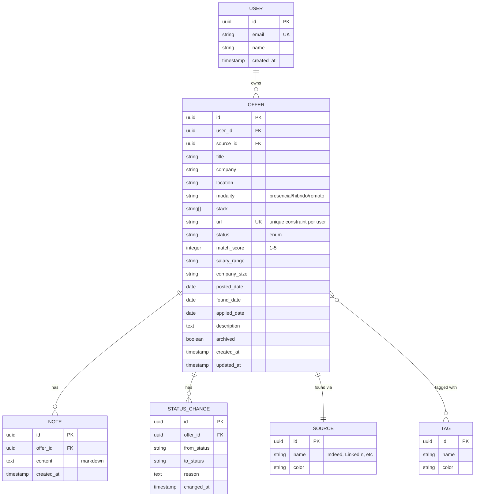

# Tech Design — JobTracker

> Decisões técnicas e arquitetura. Documento vivo — atualizar à medida que mudam decisões.

---

## 1. Stack e justificações

### Backend: Rails 8 (API mode)
**Porquê:**
- Stack do meu trabalho atual (Wiremaze) — quero aprofundar, não diversificar
- ActiveRecord poupa-me imenso código de SQL boilerplate
- RSpec + FactoryBot é o que já uso para testes
- Rails 8 trouxe Solid Queue (substitui Sidekiq para casos simples) — mas vou usar Sidekiq na V2 por mais robustez

**Alternativas consideradas:**
- ❌ Next.js (full-stack JS) — viés excessivo para JS, perderia oportunidade de mostrar Rails
- ❌ Django — não é a minha stack
- ❌ Express + Prisma — sem Rails magic, mais código boilerplate

### Frontend: React + Vite + TypeScript
**Porquê:**
- React é a minha stack atual e o que mais empresas pedem
- Vite > CRA (CRA está deprecated)
- TypeScript reduz bugs e mostra que sei tipagem

### DB: PostgreSQL
**Porquê:**
- O que uso na Wiremaze
- Plano gratuito em todos os PaaS (Render, Fly)
- JSON columns úteis para metadados flexíveis (skills array, etc)

### Deploy: Render.com
**Porquê:**
- Free tier generoso
- Suporta Rails + React + Postgres no mesmo dashboard
- Auto-deploy de GitHub push

**Alternativa:** Fly.io (mais barato para escala, mas free tier mais limitado).

---

## 2. Modelo de dados



### Status enum
```ruby
STATUSES = %w[new interested applied interview offer rejected archived].freeze
```

Transições válidas (state machine):
- `new` → `interested`, `archived`
- `interested` → `applied`, `archived`
- `applied` → `interview`, `rejected`, `archived`
- `interview` → `offer`, `rejected`
- `offer` → `accepted`, `rejected`
- (qualquer) → `archived`

Cada transição grava em `status_changes`.

---

## 3. API REST endpoints

```
GET    /api/v1/offers                 # list with filters
POST   /api/v1/offers                 # create
GET    /api/v1/offers/:id             # detail
PATCH  /api/v1/offers/:id             # update
DELETE /api/v1/offers/:id             # archive (soft delete)

POST   /api/v1/offers/:id/notes       # add note
PATCH  /api/v1/offers/:id/status      # change status (records transition)

POST   /api/v1/offers/import          # bulk JSON import
GET    /api/v1/offers/export.csv      # CSV export
GET    /api/v1/offers/export.xlsx     # XLSX export

GET    /api/v1/stats                  # dashboard analytics
```

### Filters (query params em /offers)
- `?status=new,interested` (CSV)
- `?match_score_gte=4`
- `?modality=remoto`
- `?location=Porto`
- `?source=indeed`
- `?search=ruby` (full-text em title+company+description)
- `?sort=match_score:desc`
- `?page=1&per_page=25`

---

## 4. Frontend — estrutura

```
frontend/
├── src/
│   ├── api/                 # API client (axios + react-query)
│   │   ├── offers.ts
│   │   ├── notes.ts
│   │   └── stats.ts
│   ├── components/
│   │   ├── ui/              # shadcn-style primitives (button, input, etc)
│   │   ├── OfferCard.tsx
│   │   ├── OfferFilters.tsx
│   │   ├── KanbanBoard.tsx
│   │   └── StatusBadge.tsx
│   ├── pages/
│   │   ├── OffersList.tsx
│   │   ├── KanbanView.tsx
│   │   ├── OfferDetail.tsx
│   │   └── Dashboard.tsx
│   ├── hooks/
│   │   ├── useOffers.ts
│   │   └── useOfferMutations.ts
│   ├── types/
│   │   └── offer.ts
│   └── App.tsx
└── ...
```

---

## 5. Decisões adiadas

| Decisão | Adiar para... | Porquê |
|---|---|---|
| Auth (Devise vs custom JWT) | M5 (V2) | Single-user inicialmente, sem auth |
| Background jobs (Sidekiq vs Solid Queue) | M5 | MVP é só CRUD manual + import JSON |
| Scrapers (próprios vs API parceiros) | M5 | Validar UX primeiro |
| Mobile UI (PWA?) | Post-V2 | Mobile pode esperar |
| Multi-language (PT/EN) | Post-V2 | Eu uso só PT |

---

## 6. Open questions

- **Devo expor publicamente para qualquer pessoa criar conta?** Pro: usado, gera GitHub stars. Contra: hosting custos. → Decidir em M5.
- **Integração com LinkedIn API?** Requer aprovação OAuth de LinkedIn. Talvez começar com import manual.
- **Sincronização com calendário Google?** (entrevistas) — interessante mas fora de escopo MVP.
